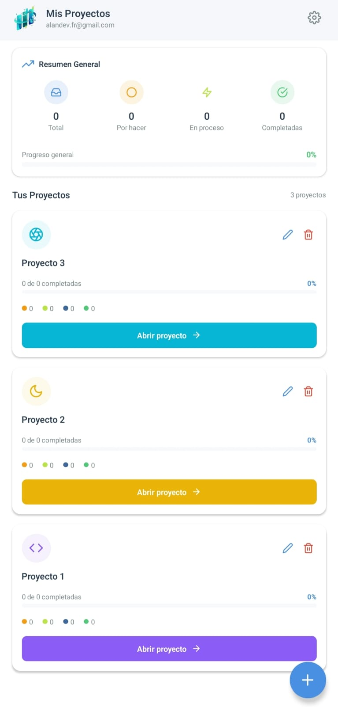
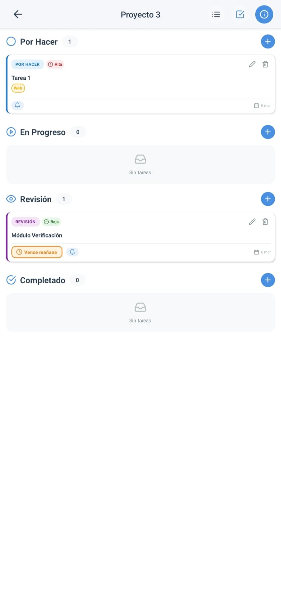
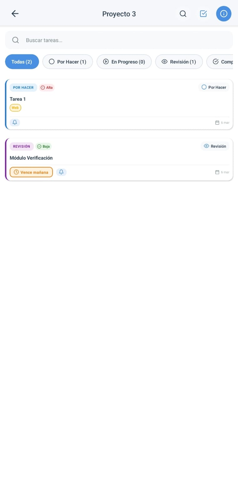
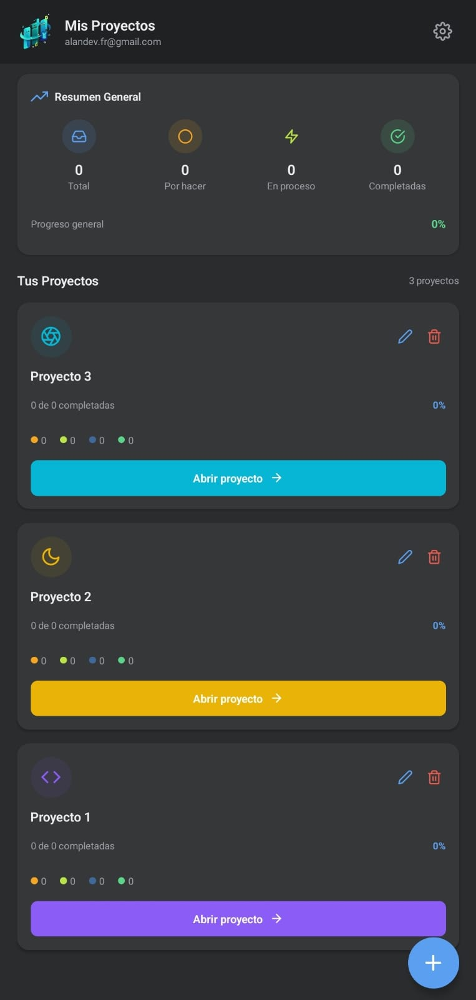
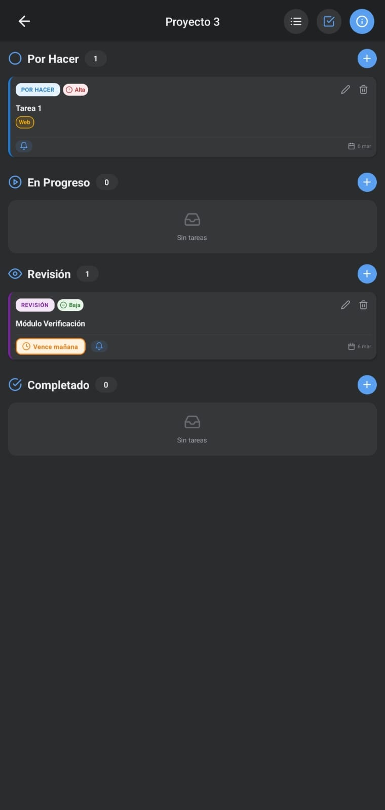
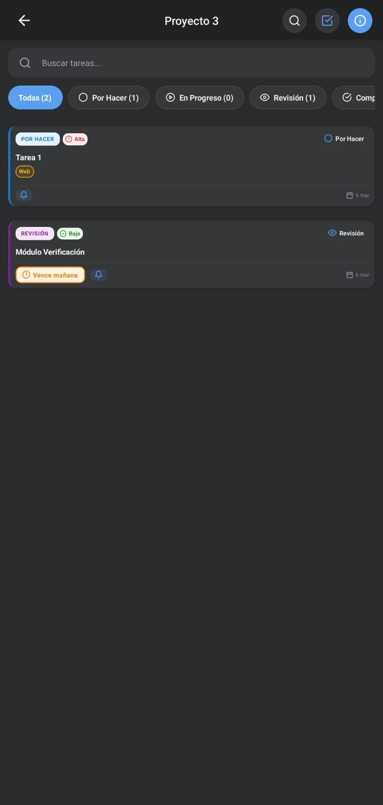

# 📱 ProjectFlow Kanban

> **Mobile-first project management app** with real-time sync, drag & drop, and push notifications. Built with React Native, Expo, and Firebase.

<div align="center">

[](https://reactnative.dev)
[](https://expo.dev)
[](https://firebase.google.com)
[](https://typescriptlang.org)

[📱 Demo en Video](#-demo) • [✨ Features](#-features) • [🛠️ Tech Stack](#️-tech-stack) • [🚀 Quick Start](#-quick-start)

</div>

---

## 🎯 El Problema

Existing project management tools like Trello are web-first and lack:
- ❌ Native mobile experience (laggy, not optimized for touch)
- ❌ Offline capabilities
- ❌ Push notifications for task reminders
- ❌ Dark mode without paying

## 💡 Mi Solución

**ProjectFlow** is a Kanban board built from the ground up for mobile, with:
- ✅ **Native iOS/Android/Web** from single codebase
- ✅ **Real-time sync** across devices (Firebase Firestore)
- ✅ **Drag & drop** optimized for touch gestures
- ✅ **Push notifications** with scheduled task reminders
- ✅ **Dark mode** included (no paywall)
- ✅ **Offline-ready** architecture (coming in v2.0)

---

## 📸 Screenshots

<div align="center">

### Light Mode
  

### Dark Mode
  

</div>

---

## 🎬 Demo

> **📲 APK available!** - Download from [Releases](https://github.com/AlanDev-fr/projectflow-kanban/releases/tag/v1.0.0)

**Want to try it now?**
- Download the latest APK from [Releases](https://github.com/AlanDev-fr/projectflow-kanban/releases)
- Enable "Install from unknown sources" on Android
- Install and run

> ⚠️ iOS requires building from source (Apple restrictions)

---

## ✨ Features

### 🏗️ Core Functionality
- **Kanban Board** with 4 columns: TODO → Doing → Review → Done
- **Drag & Drop** tasks between columns with haptic feedback
- **Real-time sync** - changes appear instantly on all devices
- **Multi-select** - delete multiple tasks at once
- **3 view modes**: Compact (mobile), Grid (tablet), Read-only

### 🎓 Interactive Tutorial
- **Step-by-step onboarding** - guides new users through the app
- **Context-aware spotlights** - highlights UI elements dynamically
- **Custom mascots** - animated companions to guide the experience
- **Persisted state** - remembers tutorial completion across sessions

### 🔔 Smart Reminders
- **Push notifications** for task deadlines
- **Custom reminder times** with date/time picker
- **Auto-cancellation** when task is completed/deleted

### 🎨 Customization
- **Project colors & icons** - personalize each project
- **Task priorities** (High/Medium/Low) with color coding
- **Custom labels** with unlimited colors
- **Dark/Light/System theme** with smooth transitions

### 🔐 Authentication
- **Email/Password** with secure Firebase Auth
- **Google Sign-In** (iOS + Android)
- **GitHub OAuth** with deep linking
- **Session persistence** - stay logged in across app restarts

### 📊 Analytics
- **Global stats** - total tasks, completion rate
- **Per-project metrics** - progress tracking
- **Visual indicators** - overdue tasks highlighted in red

---

## 🛠️ Tech Stack

<table>
<tr>
<td valign="top" width="33%">

### Frontend
- **React Native** 0.81.5
- **Expo** 54.x
- **TypeScript** 5.x
- **React Navigation** 7.x
- **Reanimated** 4.1.1 (animations)
- **Gesture Handler** 2.28.0 (drag & drop)

</td>
<td valign="top" width="33%">

### Backend
- **Firebase Auth** (email, Google, GitHub)
- **Firestore** (real-time NoSQL database)
- **Expo Notifications** (push notifications)
- **AsyncStorage** (local persistence)

</td>
<td valign="top" width="33%">

### DevOps
- **Expo EAS** (build pipeline)
- **ESLint** + **Prettier** (code quality)
- **Firestore Security Rules** (access control)

</td>
</tr>
</table>

### 🤔 Why These Technologies?

| Choice | Reason |
|--------|--------|
| **React Native + Expo** | Write once, deploy to iOS/Android/Web (3 platforms, 1 codebase) |
| **Firebase Firestore** | Real-time sync out-of-box, scales automatically, generous free tier |
| **Reanimated** | 60fps animations on UI thread (no JS bridge lag) |
| **Custom Date Pickers** | Zero dependencies, smaller bundle size, works offline |

---

## 🚀 Quick Start

### Prerequisites
- Node.js ≥ 18.x
- npm ≥ 9.x
- Expo CLI (`npm install -g expo-cli`)

### Installation

```bash
# 1. Clone repository
git clone https://github.com/AlanDev-fr/projectflow-kanban.git
cd projectflow-kanban

# 2. Install dependencies
npm install

# 3. Start development server
npm start

# 4. Build and run on device (requires Android/iOS setup)
npx expo run:android
# or
npx expo run:ios

# ⚠️ This app uses native modules and does NOT work with Expo Go

```

### Firebase Setup (Required)

1. Create project at [Firebase Console](https://console.firebase.google.com)
2. Enable **Authentication** (Email, Google, GitHub)
3. Create **Firestore Database** (test mode)
4. Download config files:
   - iOS: `GoogleService-Info.plist` → copy to project root
   - Android: `google-services.json` → copy to `android/app/`
5. Update `app.json` with your bundle IDs

**Full setup guide**: See [TECHNICAL.md](./TECHNICAL.md#firebase-setup)

---

## 📂 Project Structure

```
/
├── App.tsx                    # Entry point with providers
├── components/                # Reusable UI components
│   ├── TaskCard.tsx           # Draggable task with haptics
│   ├── DatePickerInput.tsx    # Custom date picker (no libs)
│   └── ProjectModal.tsx       # Create/edit project modal
├── screens/                   # Main app screens
│   ├── DashboardScreen.tsx    # Project list + stats
│   └── ProjectScreen.tsx      # Kanban board with 3 views
├── src/
│   ├── contexts/
│   │   ├── AuthContext.tsx    # Firebase Auth provider
│   │   └── ThemeContext.tsx   # Dark/light mode
│   └── services/
│       ├── firestore.ts       # CRUD + real-time subscriptions
│       └── notifications.ts   # Push notification system
└── constants/
    └── theme.ts               # Colors, spacing, typography
```

**Complete documentation**: [TECHNICAL.md](./TECHNICAL.md)

---

## 🔥 Key Technical Highlights

### 1. Real-Time Sync (No Polling)
```typescript
// Subscribe to projects - updates automatically when data changes
useEffect(() => {
  const unsubscribe = firestore.subscribeToProjects(userId, (projects) => {
    setProjects(projects); // Instant UI update
  });
  return unsubscribe; // Cleanup on unmount
}, [userId]);
```

### 2. Drag & Drop with Haptics
```typescript
// Optimized touch gestures with visual feedback
<PanGestureHandler onGestureEvent={handleDrag}>
  <Animated.View style={animatedStyle}>
    <TaskCard onRelease={() => Haptics.impactAsync('medium')} />
  </Animated.View>
</PanGestureHandler>
```

### 3. Custom Date Pickers (Zero Dependencies)
- Built with native `ScrollView` + `Modal` components
- No external libraries = smaller bundle size
- Works offline, full customization control

---

## 🎨 Design Philosophy

- **Mobile-first**: Every interaction optimized for touch
- **Performant**: 60fps animations, lazy rendering
- **Accessible**: High contrast ratios, large tap targets (48px min)
- **Consistent**: Single source of truth for colors/spacing (`theme.ts`)

---

## 📊 Performance Metrics

- **Bundle size**: ~8.2 MB (iOS), ~12.5 MB (Android)
- **Startup time**: <2 seconds on mid-range devices
- **Firestore reads**: Optimized with subscriptions (vs polling)
- **Animations**: 60fps guaranteed with Reanimated

---

## 🚧 Roadmap

### ✅ v1.0 (Current)
- [x] Kanban board with 3 view modes
- [x] Real-time sync across devices
- [x] Push notifications
- [x] Dark mode

### 🔄 v1.1 (In Progress)
- [ ] Task comments
- [ ] Advanced filters (priority, label, date)
- [ ] Search across all projects

### 💡 v2.0 (Planned)
- [ ] Offline mode with auto-sync
- [ ] Collaboration (invite users to projects)
- [ ] Export to PDF/CSV
- [ ] Calendar integrations (Google, Outlook)

---

## 🤝 Contributing

Contributions are welcome! Please:

1. Fork the repo
2. Create a feature branch (`git checkout -b feature/amazing-feature`)
3. Commit changes (`git commit -m 'feat: add amazing feature'`)
4. Push to branch (`git push origin feature/amazing-feature`)
5. Open a Pull Request

**Before submitting:**
- Run `npm run lint` (no errors)
- Run `npm run format`
- Test on at least one platform (iOS/Android/Web)

---

## 📄 License

This project is licensed under the **MIT License** - see the [LICENSE](./LICENSE) file for details.

---

## 📬 Contact

**Looking for a React Native developer?**

- 💼 Open to remote opportunities (LATAM/USA timezones)
- 🌎 Based in Quito, Ecuador
- 🇺🇸 English: A2 Technical
- 📧 Email: alandev.fr@gmail.com
- 💻 LinkedIn: [Alan Dev](https://www.linkedin.com/in/alan-dev-48a9893ab/)
- 🐙 GitHub: [@AlanDev-fr](https://github.com/AlanDev-fr)

---

<div align="center">

**Built with ❤️ using React Native + Expo + Firebase**

⭐ Star this repo if you find it useful!

</div>
